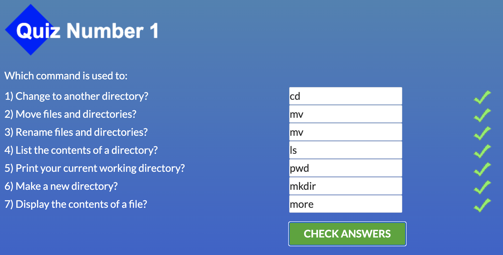

<!-- 
name (at least) one thing that was new to you
name (at least) one thing that surprised you
name (at least) one thing you intend to use in the future
-->
<h1>kottans-frontend</h1>

<h2>Impressions about learned materials</h2>
<ul>
  <li>It was interesting to work with HEAD. In practice, I haven`t worked with it before.</li>
  <li>Rebase:) I think it`s pretty the same as previous. I`ve heard about it but always use merging. It was a good practice.</li>
  <li>I`ll use a command-line for git operations to master my skills.</li>
</ul>

<h2>Linux CLI, and HTTP</h2>
<h3>Linux Survival</h3>
<ul>
  <li>grep, pipe</li>
  <li>power of combination with 'pipe'</li>
  <li>ofc. pipe</li>
</ul>
<h3>HTTP</h3>
<ul>
  <li>request vers as HEAD, TRACE, OPTIONS, cashing</li>
  <li>really, i don't know, all of that was helpful</li>
  <li>i think, i have to use all of this</li>
</ul>
<ul>
  <li></li>
  <li></li>
  <li></li>
  <li></li>
</ul>

<h2>Git Collaboration</h2>
<h3>GitHub & Collaboration</h3>

<ul>
  <li>Setting up two remote repo(origin and uppstream)</li>
  <li>Git commands has --grep too:)</li>
  <li>Rebase for squashing by CL. I`ve used for it GITLAB interface before.</li>
</ul>
<h3>Learn git branching</h3>

<ul>
  <li>Cherry pick</li>
  <li>Deleting and creating branches with push and fetch</li>
  <li>Pushing, pulling etc. without checkout.</li>
</ul>

<h2>Intro to HTML and CSS</h2>

<h3>Into to HTML & CSS(udacity)</h3>

Just have refreshed my knowledge

<h3>Learn HTML(Eng)</h3>

Just have refreshed my knowledge

<h3>Learn HTML(Eng)</h3>

Just have refreshed my knowledge

<h2>Responsive Web Design</h2>

<h3>Responsive Web Design Fundamentals</h3>

<ul>
  <li>40x40 - min size for mobile buttons, media attribute in in link tag</li>
  <li>mark up patterns has names too(column drop, mostly fluid, layout shifter, off canvas)</li>
  <li>I`ll check if all of the buttons have 40x40px min size on tap devices</li>
</ul>

<h3>Flexbox Froggy</h3>

Wrap-reverse - new thing that surprised me that I`m going to use :D

<h2>HTML & CSS practice</h2>

<ul>
  <li>How to make label focusable</li>
  <li>Github pages deployment from picked branch</li>
  <li>Github pages</li>
</ul>

<h2>JavaScript Basics</h2>

In general, this part for me was about 'done, done, done', but some points was surprising and interesting:

<ul>
  <li>I haven`t use destructuring in function parameters before. It`s really comfortable. I`ll definitely use it.</li>
  <li>One more think about destructuring - swiping values between variables. It`s surprised me.</li>
  <li>Function programming - I heard about it, but haven`t used it. It was good practice and knowledge.</li>
  <li>And, the funniest: I`ve always called function parameters as arguments. xD</li>
</ul>

<h2>DOM</h2>
<h3>JavaScript and the DOM</h3>

Information about interfaces and inheritances was helpful. Now I understand, how to correctly find out methods and properties that I need on MDN.

The difference between textContent and innerText was surprising. 

The performance part was especially interesting(createDocumentFragment was new for me)

<h3>Freecodecamp Algorithm Scripting Challenges</h3>

This part was certainly challenging. In this part, I received a lot of new information, like how to find common multiple, convert binary to string, generate primes, etc.

I think all of this information will be useful in the future.

<h2>Object-Oriented JavaScript</h2>
<h3>Object Oriented JS</h3>

I`ve known about prototypes before, but a lot of information was new to me.:

<ul>
  <li>Object.create() - i used to use 'obj.__proto__' to define prototype chain.</li>
  <li>'Function Classes' and 'Prototypal Classes' patterns were new for me and helped me to understand a lot..</li>
  <li>I`ve read about 'PseudoClassical Subclasses' before but never used it. It was good practice.</li>
</ul> 
